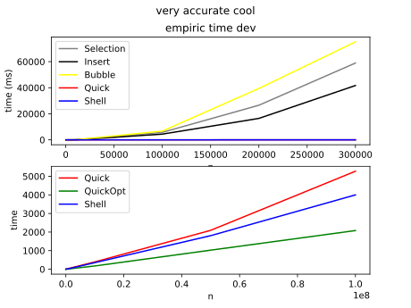

# gort
Slice sorting in golang.

Can be used as a reference point.
Currently the following algorithms are implemented:
1) Insertion
2) Selection
3) Bubble
4) Quick
5) Shell

Functions use the following type constraint:
```
type Ordered interface {
	Integer | Float | ~string
}
```
The solutions provided are not garanteed to be the best implementation available!



Sources used:
1) [Toptal.com Sorting-Algorithms](https://www.toptal.com/developers/sorting-algorithms)
